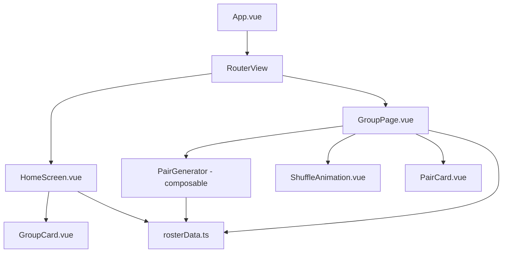

# Design Document: Patch Group Pair Generator

## Overview

The Patch Group Pair Generator is a client-side Vue 3 single-page application that enables group leaders to randomly generate chat pairs within their patch groups. The app uses Vue Router for navigation between a home screen (showing 15 group cards) and individual group detail pages. All roster data is hardcoded — no backend or API calls are needed.

Key design decisions:

- **Vue 3 Composition API** with `<script setup>` for concise, modern component authoring
- **Vue Router** for SPA navigation between home and group pages
- **Pure functions** for pair generation logic, making it easy to test independently of the UI
- **CSS Grid** for responsive layouts with no external UI framework dependency
- **requestAnimationFrame-based animation** for the shuffle effect, keeping it lightweight

## Architecture



The app follows a simple two-page architecture:

1. **HomeScreen** — Displays 15 `GroupCard` components in a responsive grid. Each card links to its group's detail page.
2. **GroupPage** — Shows the group roster, a "Generate Pairs" button, the shuffle animation, and the resulting pair/trio cards.

### Routing

| Route                 | Component        | Description                          |
| --------------------- | ---------------- | ------------------------------------ |
| `/`                   | `HomeScreen.vue` | Landing page with all 15 group cards |
| `/group/:groupNumber` | `GroupPage.vue`  | Detail page for a specific group     |

The `:groupNumber` param is validated to be 1–15. Invalid routes redirect to home.

### Component Tree

```
App.vue
├── HomeScreen.vue
│   └── GroupCard.vue (×15)
└── GroupPage.vue
    ├── ShuffleAnimation.vue
    └── PairCard.vue (×N)
```

## Components and Interfaces

### `rosterData.ts` — Static Data Module

Exports the hardcoded roster as a typed data structure. This is the single source of truth for all group/member data.

```typescript
interface Member {
  fullName: string;
  department: string;
}

interface PatchGroup {
  groupNumber: number;
  theme: string;
  members: Member[];
}

export const patchGroups: PatchGroup[];
```

### `pairGenerator.ts` — Pure Logic Module

Contains the pair generation algorithm as pure functions with no Vue dependencies.

```typescript
interface Pair {
  members: [Member, Member];
}

interface Trio {
  members: [Member, Member, Member];
}

interface GenerationResult {
  pairs: Pair[];
  trio: Trio | null;
}

function generatePairs(members: Member[]): GenerationResult;
function shuffleArray<T>(array: T[]): T[];
```

**Algorithm:**

1. Create a copy of the members array
2. Fisher-Yates shuffle the copy
3. If the count is odd, pop the last 3 members into a `Trio`
4. Iterate remaining members in steps of 2, creating `Pair` objects
5. Return `{ pairs, trio }`

### `GroupCard.vue`

Props:

- `groupNumber: number`
- `theme: string`

Renders a clickable card with "Patch Group {N}" and the theme name. Navigates to `/group/:groupNumber` on click.

### `HomeScreen.vue`

No props. Imports `patchGroups` from `rosterData.ts` and renders a `GroupCard` for each group in a CSS Grid, sorted by `groupNumber`.

### `GroupPage.vue`

Uses route param `groupNumber` to look up the group from `rosterData.ts`. Manages state for:

- `generationResult: GenerationResult | null` — the current pairs
- `isAnimating: boolean` — whether the shuffle animation is playing

On "Generate Pairs" click:

1. Set `isAnimating = true`
2. Compute the result via `generatePairs(group.members)` (computed immediately but held back)
3. Start `ShuffleAnimation`
4. On animation complete callback, set `isAnimating = false` and reveal results

### `ShuffleAnimation.vue`

Props:

- `members: Member[]` — the member names to cycle through
- `isActive: boolean` — controls start/stop

Emits:

- `complete` — fired when animation finishes

Displays a grid of name slots that rapidly cycle through random member names for 1.5–2 seconds, then settles. Uses `setInterval` with decreasing speed to create a "slot machine" deceleration effect.

### `PairCard.vue`

Props:

- `members: Member[]` — 2 or 3 members
- `index: number` — sequential number (1-based)
- `isTrio: boolean` — whether to show the "Trio" label

Renders a card with the pair/trio number, member names, and a "Trio" badge when applicable.

## Data Models

### Core Types

```typescript
// Member within a patch group
interface Member {
  fullName: string;
  department: string;
}

// A patch group with its roster
interface PatchGroup {
  groupNumber: number; // 1–15
  theme: string; // e.g., "Interdependence", "Badassitude", "Love", "Elevate", "Empowered Ownership"
  members: Member[]; // 9–11 members
}

// A generated pair of two members
interface Pair {
  members: [Member, Member];
}

// A generated trio of three members (odd group size)
interface Trio {
  members: [Member, Member, Member];
}

// Result of pair generation for a group
interface GenerationResult {
  pairs: Pair[];
  trio: Trio | null; // null when group has even member count
}
```

### Static Data Shape

The roster data is stored as a flat array of `PatchGroup` objects:

```typescript
export const patchGroups: PatchGroup[] = [
  {
    groupNumber: 1,
    theme: "Interdependence",
    members: [
      { fullName: "Jane Doe", department: "Engineering" },
      // ... 8-10 more members
    ],
  },
  // ... 14 more groups
];
```

### Lookup Helper

```typescript
export function getGroupByNumber(groupNumber: number): PatchGroup | undefined {
  return patchGroups.find((g) => g.groupNumber === groupNumber);
}
```
